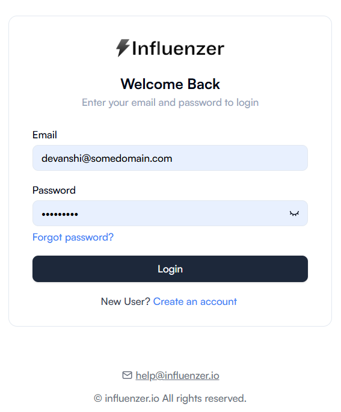
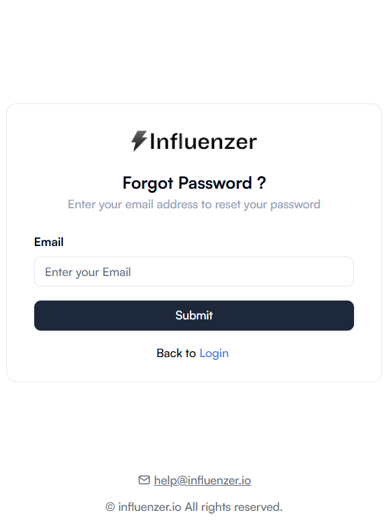
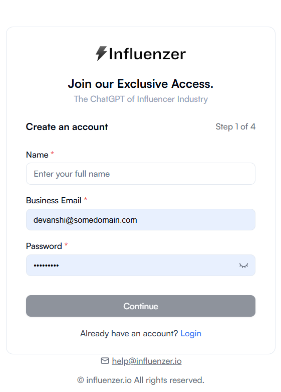

# Influenzer Authentication Guide

This guide provides detailed, step-by-step instructions for **Logging In**, **Signing Up**, and **Resetting Your Password** on the **Influenzer** platform.  
It is designed to help new users easily navigate the authentication process.

---

## 1️⃣ Log In to Your Account

### Steps

1. **Open the Login Page**  
   Go to [https://staging.influenzer.io/login](https://staging.influenzer.io/login) in your web browser.

2. **Enter Your Email Address**

   - Use the email you registered with on Influenzer.
   - Make sure there are no spaces before or after the email.

3. **Enter Your Password**

   - Passwords are case-sensitive.
   - Ensure Caps Lock is off.
   - If you have recently reset your password, use the latest one.

4. **Click the "Login" Button**

   - If credentials are correct, you’ll be redirected to your **Dashboard**.
   - If credentials are incorrect, an error message will appear.

5. **Troubleshooting Login Issues**
   - Double-check your email and password.
   - If you forgot your password, follow the **Forgot Password** steps below.

📸 **Screenshot:**  

---

## 2️⃣ Reset Your Password (Forgot Password)

### Steps

1. **Go to the Login Page**

   - [Influenzer Login Page](https://staging.influenzer.io/login)

2. **Click “Forgot Password”**

   - This link is usually located below the login form.

3. **Enter Your Registered Email Address**

   - Use the email linked to your account.
   - Double-check spelling before proceeding.

4. **Click “Send Reset Link”**

   - A password reset email will be sent to you.

5. **Check Your Email Inbox**

   - Look for an email from **support@influenzer.io**.
   - If not found, check the **Spam** or **Junk** folder.

6. **Open the Email & Click the Reset Link**

   - This will redirect you to the password reset page.
   - For security, reset links usually expire after a set time (e.g., 24 hours).

7. **Set a New Password**
   - Must meet platform’s password requirements (e.g., minimum length, special characters).
   - Confirm your new password.

📸 **Screenshot:**  

---

## 3️⃣ Create a New Account (Sign Up)

### Steps

1. **Go to the Sign-Up Page**

   - From the login screen, click **Sign Up**.

2. **Fill in Required Details**

   - **Full Name:** Enter your first and last name.
   - **Email Address:** Provide a valid email address.
   - **Password:** Choose a strong password that meets security requirements.
   - **Other Required Fields:** Fill any additional information requested by the form.

3. **Click “Sign Up”**

   - Your account will be created.

4. **Verify Your Email**
   - Check your inbox for a verification email.
   - Click the verification link to activate your account.
   - If the email doesn’t arrive, check your spam folder.

📸 **Screenshot:**  

---

## Notes & Tips

- **Password Security:** Use a mix of uppercase, lowercase, numbers, and symbols.
- **Email Verification:** You must verify your email to access all platform features.
- **Browser Compatibility:** Works best on Chrome, Edge, or Firefox.
- **Support:** For assistance, contact **support@influenzer.io**.

---

**Author:** Influenzer Team  
**Last Updated:** August 2025
